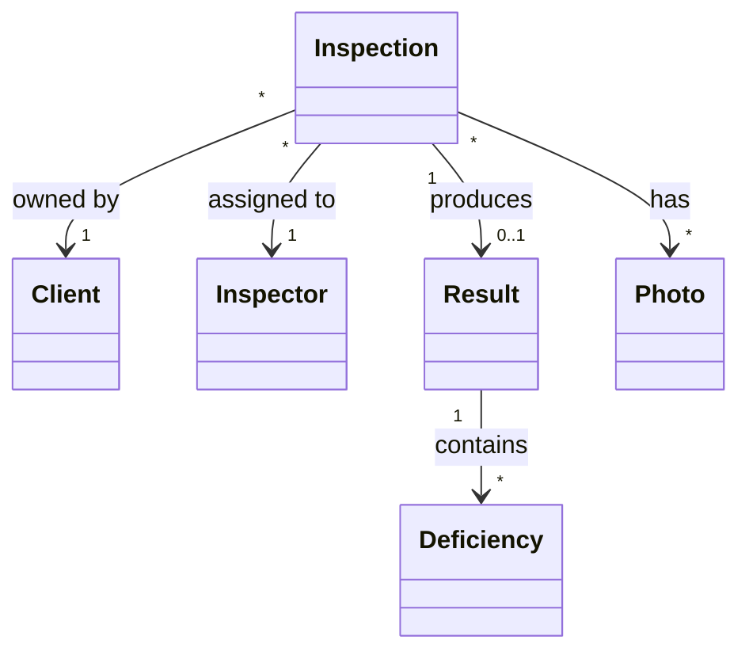
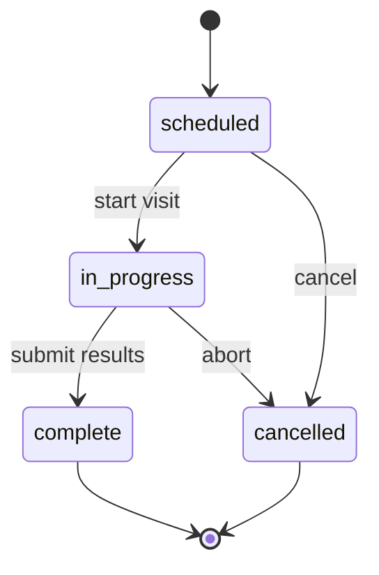

<!-- Template: models.md (Django/Rails/JPA/Mongoose/etc data models). -->
<!-- Subagent: copy, fill, then verify. -->

<!-- docs:auto -->
# {{Module}} — Models

<!-- auto:start id=summary -->
{{Paragraph: which models live in this module + the dominant relationship pattern. If there's a key state machine, mention it.}}

| | |
|---|---|
| **Source dir** | [`{{path/to/models/}}`]({{rel}}) |
| **ORM** | {{Django ORM / ActiveRecord / SQLAlchemy / JPA / Mongoose / Prisma / Drizzle}} |
| **Multi-tenancy** | {{e.g., "scoped by `group_id` (cross-cutting)"}} or "single-tenant" |
| **Soft delete** | {{e.g., "via `deleted_at` mixin on Inspection only"}} or "none" |
<!-- auto:end -->

<!-- auto:start id=er-diagram -->
## Entity relationships

(Include this diagram only if 4+ models with relationships. For ≤3 models, omit and rely on per-model "Relationships" tables.)

<!-- auto:end -->

<!-- auto:start id=models -->
## Models

### `Inspection`

> {{One-line domain summary.}}

**Source**: [`{{path}}:{{line}}`]({{rel-link}})

<b>🗂️ Fields</b>

| Field | Type | Constraints | Purpose |
|-------|------|-------------|---------|
| `id` | int (PK) | — | — |
| `client` | FK → Client | NOT NULL, ON DELETE CASCADE | Owning client |
| `inspector` | FK → User | NOT NULL | Assigned inspector |
| `scheduled_at` | datetime | NOT NULL, indexed | When the visit is scheduled |
| `status` | str | NOT NULL, default `scheduled` | See **State machine** below |
| `result` | JSON | nullable | Persisted on completion |
| `created_at` / `updated_at` | datetime | auto | Audit |

<b>🔗 Relationships</b>

- `client` → `Client` (many-to-one, cascade delete)
- `inspector` → `User` (many-to-one, restrict)
- `photos` → `Photo` (one-to-many, reverse FK)
- `result` → `Result` (one-to-one)

<b>🔁 State machine</b> (status field)

Transition rules:
- `scheduled → in_progress` only by the assigned inspector
- `scheduled → cancelled` requires `cancel_reason` to be set
- `in_progress → complete` requires at least one Result row

<b>📚 Custom managers / scopes</b>

| Name | What it queries |
|------|-----------------|
| `Inspection.objects.upcoming()` | scheduled_at in future, status=scheduled |
| `Inspection.objects.for_inspector(user)` | filter by assigned inspector |

(Skip block if no custom managers/scopes.)

<b>⚙️ Lifecycle hooks</b>

- `pre_save`: ensures `scheduled_at` is timezone-aware
- `post_save` (when status transitions to `complete`): fires `inspection.completed` signal

(Skip block if none.)

<b>📦 Indexes</b>

- `(client_id, scheduled_at)` — composite for client dashboard queries
- `inspector_id, scheduled_at` — for inspector schedule lookups
- `status` — for filter queries

::: tip Source
[`Inspection`]({{rel-link}}#L{{line}})
:::

---

{{repeat for every model in this module}}
<!-- auto:end -->

<!-- auto:start id=footer -->
*Generated by `/generate-docs`. Last regenerated: {{ISO-date}}.*
<!-- auto:end -->
