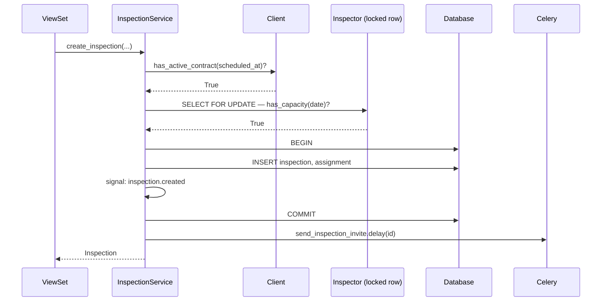

<!-- Template: services.md or services/<class>.md (for SUBFOLDER modules with many services). -->
<!-- Subagent: copy, fill, then verify per snippets/verification-checklist.md. -->

<!-- docs:auto -->
# {{Module}} — Services

<!-- auto:start id=summary -->
{{One paragraph: what the service layer in this module owns. Which classes/files. What it sits between (typically: API/handlers above, models/repositories below).}}

| | |
|---|---|
| **Source files** | [`{{path/to/services.py}}`]({{rel}}), [`{{path/to/queries.py}}`]({{rel}}) |
| **Style** | {{e.g., "Django service module (functions, not classes) + MongoDB query builders"}}, {{e.g., "Service-Object pattern with `Result.success/failure`"}}, {{e.g., "Facade over GraphQL resolvers"}} |
| **Cross-repo callers** | {{summary like the api file — none / list count}} |
<!-- auto:end -->

<!-- auto:start id=services-toc -->
## Services in this module ({{N}})

| Method | At-a-glance |
|--------|-------------|
| [`{{ServiceClass.method}}`](#servicemethod) | {{e.g., "Coordinates create + signal + queue (3 collaborators)"}} |
| [`{{another_service}}`](#anotherservice) | |
<!-- auto:end -->

<!-- auto:start id=services -->
## Services

### `{{ServiceClass.method}}` (or `module_name.function`)

> {{One-line summary in domain terms.}}

| | |
|---|---|
| **Signature** | `{{ServiceClass.method(arg1: T, arg2: U, *, by_user: User) -> Inspection}}` |
| **Source** | [`{{path}}:{{line}}`]({{rel-link}}) |
| **Called by** | {{list of callers from the graph — viewsets, other services, signals}} |

<details>
<summary><b>📋 Parameters</b></summary>

| Name | Type | Required | Description |
|------|------|----------|-------------|
| `arg1` | int | ✓ | {{...}} |
| `arg2` | dict | — | {{...}} |
| `by_user` | User (kw-only) | ✓ | {{e.g., "Audit-trail; persisted on the new record"}} |

</details>

<details>
<summary><b>📤 Returns</b></summary>

```python
Inspection  # the newly created record, refreshed after signal handlers
# OR
Result(success=True, data=Inspection(...))  # if Result-Object pattern
# OR
None  # if void
```
</details>

<details>
<summary><b>⚠️ Raises</b></summary>

| Exception | When |
|-----------|------|
| `ContractError` | {{e.g., "client has no active contract for `scheduled_at`"}} |
| `CapacityError` | {{e.g., "inspector at daily_capacity"}} |

(Or "**None** — function is total over its declared types" if no exceptions.)

</details>

<details open>
<summary><b>⚙️ How it works</b></summary>

{{**Plain natural-language walkthrough — NOT annotated code.** See prompts/04-cluster.md "How to write 'How it works'" for rules.

For service methods that orchestrate ≥3 collaborators, include a mermaid sequenceDiagram alongside the prose. The diagram supplements the narrative; it doesn't replace it.

Example walkthrough for `InspectionService.create_inspection`:}}

The handler validates capacity and contract window, creates the records inside a transaction, and queues out-of-band work outside the transaction so that signal handlers don't block the response.

First, it asks the client whether `scheduled_at` falls within an active contract window. If not, it raises `ContractError` and nothing else happens. Then it asks the inspector whether they have capacity that day — `select_for_update` locks the inspector row to prevent two concurrent requests from double-booking. If capacity check passes, the database transaction begins.

Inside the transaction: a new `Inspection` row is created with `status='scheduled'`, an `InspectionAssignment` row links the inspector, and the `inspection.created` signal fires. Signal handlers run synchronously inside the transaction by design — failures roll the whole thing back.

Outside the transaction: the `send_inspection_invite` celery task is queued. This is deliberately out-of-band — calendar invite generation can fail or be slow without affecting the response.

The `select_for_update` lock + transaction together prevent double-booking even under load. The 'check then create' pattern would race without the lock.



</details>

<details>
<summary><b>📦 Side effects</b></summary>

- DB writes: `Inspection`, `InspectionAssignment`
- Signal: `inspection.created` (subscribed by `notifications` module)
- Queue: `send_inspection_invite` celery task
- (Or "**None — pure function**" if applicable)

</details>

::: tip Source
[`{{ServiceClass}}.{{method}}`]({{rel-link}}#L{{line}})
:::

---

{{repeat for every public service method}}
<!-- auto:end -->

<!-- auto:start id=footer -->
*Generated by `/generate-docs`. Last regenerated: {{ISO-date}}.*
<!-- auto:end -->
