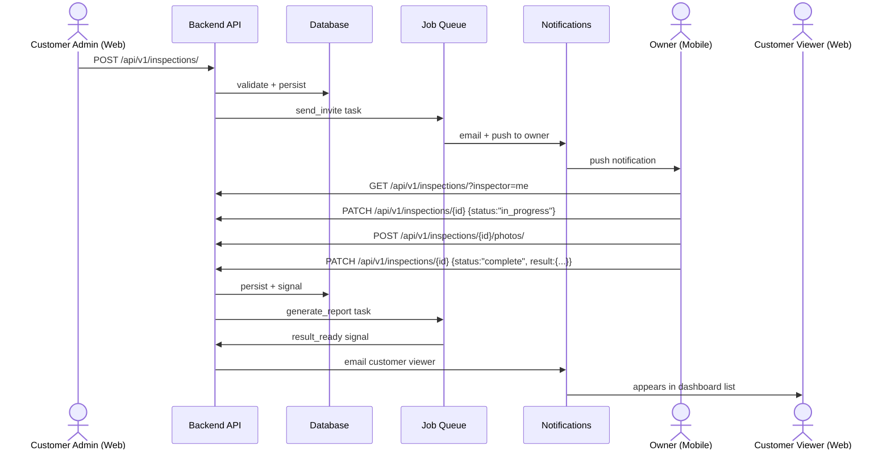

<!-- Template: <group-docs>/product/user-journeys/<journey>.md (cross-repo narrative). -->
<!-- Used in Pass 7 (group synthesis). Subagent: copy, fill, verify. -->

<!-- docs:auto -->
# {{Journey name — e.g., "Inspection lifecycle", "Onboarding", "Renewal"}}

<!-- auto:start id=summary -->
{{1-2 sentences: which actors + what outcome this journey produces. Aimed at non-tech readers.}}

| | |
|---|---|
| **Actors** | {{e.g., "Customer admin (web), Owner (mobile), Customer viewer (web)"}} |
| **Repos involved** | {{list — e.g., "myapp-frontend, myapp-backend, myapp-mobile"}} |
| **Trigger** | {{what starts this journey — e.g., "Customer admin schedules an inspection"}} |
| **Outcome** | {{what ends it — e.g., "Result published; emails sent; dashboard updated"}} |
<!-- auto:end -->

<!-- auto:start id=actors -->
## Actors

- **Customer admin** (web) — schedules and reviews
- **Owner** (mobile) — performs inspection in the field, uploads photos
- **Customer viewer** (web) — sees the result on dashboard

<!-- auto:end -->

<!-- auto:start id=flow -->
## End-to-end flow

<!-- auto:end -->

<!-- auto:start id=narrative -->
## Walkthrough (plain language)

{{Paragraph 1: what triggers the journey + the first concrete user action. Avoid jargon. Name the actor.}}

{{Paragraph 2: the next step — what happens server-side, what the user sees.}}

{{...as many paragraphs as the journey has phases. Aim for non-tech readers — a PM should understand this.}}

{{Final paragraph: what's the user-visible outcome on each surface (web, mobile, email).}}
<!-- auto:end -->

<!-- auto:start id=touchpoints -->
## Touchpoints (per repo)

### Frontend ({{frontend-repo}})
- Page: [`{{ScreenName}}`]({{rel-link}})
- Service: [`{{serviceFn}}`]({{rel-link}})

### Backend ({{backend-repo}})
- Endpoint: [`{{METHOD path}}`]({{rel-link}})
- Service: [`{{ServiceClass.method}}`]({{rel-link}})

### Mobile ({{mobile-repo}})
- Screen: [`{{ScreenName}}`]({{rel-link}})
- Service: [`{{serviceFn}}`]({{rel-link}})
<!-- auto:end -->

<!-- auto:start id=domain-rules -->
## Domain rules surfaced by this flow

The non-obvious business rules that govern this journey:

- {{e.g., "An inspection cannot be created outside the customer's contract window"}}
- {{e.g., "An inspector can't exceed `daily_capacity` (default: 4) per day"}}
- {{e.g., "Photos must be uploaded before status can move to `complete`"}}
- {{e.g., "Result emails only fire for the Massachusetts jurisdiction"}}
<!-- auto:end -->

<!-- auto:start id=failure-modes -->
## Failure modes & recoveries

How this flow handles things going wrong:

- **Network failure mid-upload (mobile)** — photos retry with exponential backoff; status stays `in_progress` until success.
- **Capacity race** — `select_for_update` on the inspector row prevents double-booking; concurrent requests retry once on conflict.
- **Email send failure** — logged but does not block the status transition. 🟡 *retry policy unclear from current code; investigate.*
<!-- auto:end -->

<!-- auto:start id=footer -->
*Generated by `/generate-docs`. Last regenerated: {{ISO-date}}.*
<!-- auto:end -->
