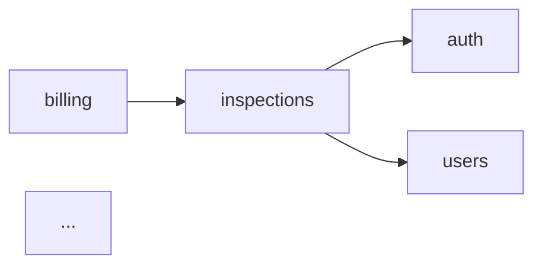

# Pass 3 — Repo overview

Write `<repo>/docs/README.md` and `<repo>/docs/overview.md`.

## Your goal

Two pages that together let a new contributor "get the shape" of the codebase in 10 minutes — without reading any source files.

## Files to produce

**Note**: write **`index.md`** as the homepage (NOT `README.md`). VitePress (Pass 9) and GitHub both render `index.md` as the folder default. This is a single source of truth — eliminates the README/index duplication that broke cross-links in earlier runs.

### `docs/index.md` — TOC + map (short, ~150-300 words + diagram)

Required sections:

```markdown
<!-- docs:auto -->
---
layout: home
hero:
  name: "<Repo display name>"
  tagline: "<one-line description from docs-config.json>"
  actions:
    - theme: brand
      text: Read the overview
      link: /overview
    - theme: alt
      text: Browse modules
      link: /modules/
    - theme: alt
      text: Reference
      link: /reference/
---

<!-- auto:start id=intro -->
1-paragraph: what this repo is + how it fits in the group.
Use the domain context (product summary, primary users) to frame it.
<!-- auto:end -->

<!-- auto:start id=map -->
## Where to find what

| If you want to... | Read |
|-------------------|------|
| Get the system shape | [overview.md](overview.md) |
| Work on a feature | [modules/](modules/) |
| Look up an endpoint | [modules/<feature>/api.md](...) |
| Understand auth/permissions | [cross-cutting/permissions.md](...) |
| Set up locally | [how-to/local-dev.md](...) |
| Find an env var | [reference/config.md](...) |
<!-- auto:end -->

<!-- auto:start id=module-index -->
## Modules



| Module | What it owns | LOC |
|--------|--------------|-----|
| [inspections](modules/inspections/) | Inspection lifecycle, scheduling, results | 4231 |
| [auth](modules/auth/) | Token-based auth, password reset | 1844 |
| ... |
<!-- auto:end -->

<!-- auto:start id=group-context -->
## Part of the **<group>** group

This repo is one of <N>:
- **<other-repo>** — <one-line role from group registry>
- ...

Cross-repo flows: [<group-docs-path>/architecture/flows/](...)
Product overview: [<group-docs-path>/product/overview.md](...)
<!-- auto:end -->

<!-- auto:start id=footer -->
*Generated by `gfleet docs`. Edit auto:* sections only via `gfleet docs <group>`.*
*Last generated: <ISO-date>*
<!-- auto:end -->
```

### `docs/overview.md` — narrative (~600-1000 words)

Goal: read this once, understand the codebase shape. Specifically:

```markdown
<!-- docs:auto -->
# <Repo> — overview

<!-- auto:start id=elevator-pitch -->
## What this codebase is

2-3 paragraphs. Use the domain product summary as anchor. Explain what
problem THIS repo solves (vs the others in the group). Name the stack
(<framework>, <runtime>, <key libs>). State the primary entry point(s).
<!-- auto:end -->

<!-- auto:start id=architecture -->
## Architecture at 10,000 feet

A short narrative of the system's shape — request lifecycle, layering
(views → services → models, or pages → hooks → API), where state lives,
how concerns are separated. Reference the modules by name.

A mermaid diagram if it helps (request flow, layering).
<!-- auto:end -->

<!-- auto:start id=key-concepts -->
## Key concepts

Domain terms that show up everywhere. Pull from `docs-config.json`
vocabulary plus 5-10 more terms inferred from the most-connected
nodes. 1-2 sentences per concept.

Example:
- **Inspection** — a scheduled visit by an inspector to a client property,
  resulting in a Result and possibly a Report.
- **Inspector** — field worker who performs inspections; has assignments
  and capacity limits.
- **Client** — paying customer; owns properties, contracts, and inspections.
<!-- auto:end -->

<!-- auto:start id=entry-points -->
## Entry points

Where execution starts. Stack-dependent:
- Django: `manage.py`, `wsgi.py`, `urls.py` top-level
- React/Vite: `src/main.tsx`, `index.html`, the root router
- RN/Expo: `app.json` start, the navigator root
- Go: `cmd/<service>/main.go`

Brief explanation per entry point: what it does, where to look next.
<!-- auto:end -->

<!-- auto:start id=read-next -->
## Read next

- For a feature deep-dive: pick from [modules/](modules/)
- For cross-cutting concerns: [cross-cutting/](cross-cutting/)
- For the group-level picture: [<group-docs>/](<absolute-path>)
<!-- auto:end -->
```

## How to write this without reading 80 source files

You have:
- The inventory (`.inventory.json`) — module shapes
- The graph (`graphify-out/graph.json`) — top god nodes per module
- The domain context — vocabulary, product summary

What to **read** (selectively):
- The very top of each entry point file (first 30 lines for the docstring/comment)
- Top god nodes from each module — read the class/function docstring only, not the body
- The repo-level README.md

That's enough. Don't pull whole files into context.

## Output rules

- Use the domain vocabulary verbatim (`preferred_terms`, avoid `avoid_terms`).
- Mermaid diagram in module-index must use only modules with ≥1 inbound or outbound edge from the inventory.
- The footer's "Last generated" date should be ISO-8601 date (not full timestamp).

## After writing

Update `docs/.metadata.json`:
```json
{
  "version": 1,
  "files": {
    "README.md": {
      "generated_at": "<ISO-8601>",
      "sources": [],          // README is derived from inventory + manifest, not specific files
      "section_fingerprint": "..."
    },
    "overview.md": {
      "generated_at": "<ISO-8601>",
      "sources": [
        {"path": "manage.py", "sha": "..."},
        {"path": "<entry-point>", "sha": "..."}
      ],
      "section_fingerprint": "..."
    }
  }
}
```

Then proceed to `prompts/04-cluster.md`.
