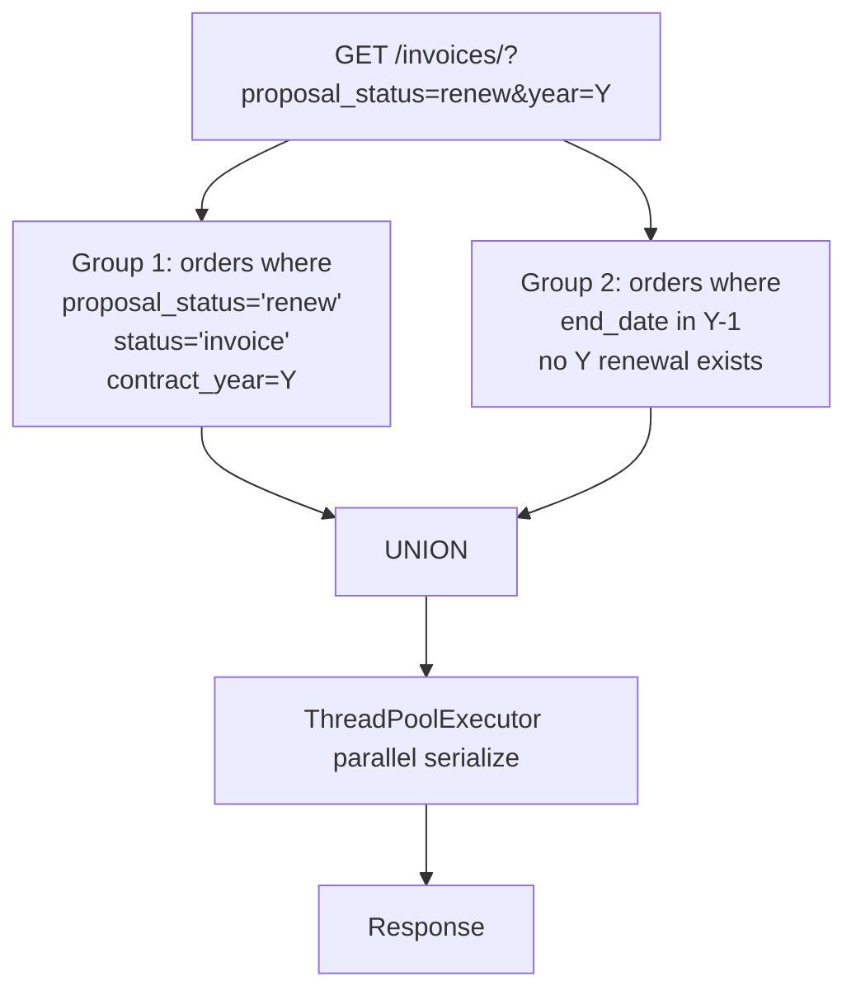

# Pass 4 — Per-cluster deep dive

The expensive pass. Per-module, write the artifact pages decided in the plan.

This file is **also the subagent prompt** when running on Claude Code with parallelism. The orchestrator dispatches one subagent per module-artifact pair (or per module, depending on size), passing this prompt + module-specific data + the stack convention.

---

## Required reading before writing any file (MANDATORY)

You MUST read these snippets at the start of Pass 4 (or when a subagent is dispatched). They are short, single-purpose, and lock consistency across all subagents:

1. `snippets/writing-style.md` — voice, tense, vocabulary, length targets, what TO write / what NOT to write. **Without this, 20 subagents write in 20 voices.**
2. `snippets/verification-checklist.md` — the per-artifact completeness checklist you MUST run before marking any file as done. **Without this, gaps slip through as placeholders.**
3. `snippets/auto-marker-rules.md` — auto/human region rules so re-runs preserve human edits.
4. `snippets/cross-link-format.md` — how to write cross-repo links via the merged graph.
5. `snippets/confidence-markers.md` — when to use 🟡 vs 🔴 (do not conflate).

Templates to use as starting structure (pick the one matching the artifact you're writing):

| Artifact you're writing | Template |
|------------------------|----------|
| `modules/<name>/index.md` (module homepage) | `output-templates/module-readme.md` |
| `modules/<name>/api/<class>.md` or `api.<class>.md` | `output-templates/api-class.md` (Swagger-card format) |
| `modules/<name>/services.md` or `services/<class>.md` | `output-templates/services.md` |
| `modules/<name>/models.md` | `output-templates/models.md` |
| `modules/<name>/components.md` (frontend/mobile) | `output-templates/components.md` |
| `modules/<name>/hooks.md` or `composables.md` | `output-templates/hooks.md` |
| `modules/<name>/screens.md` or `pages.md` | `output-templates/screens.md` |
| `cross-cutting/<concern>.md` | `output-templates/cross-cutting.md` |
| `infra/components/<name>.md` (terraform/cdk) | `output-templates/infra-component.md` |
| `<group-docs>/product/user-journeys/<journey>.md` (Pass 7) | `output-templates/user-journey.md` |
| `<group-docs>/decisions/template.md` | `output-templates/adr-template.md` |
| `<group-docs>/architecture/flows/<flow>.md` (Pass 7) | adapt `user-journey.md` (technical, not user-facing) |
| Anything else | inline templates below ("Concrete file templates" section) |

The skill ships these templates pre-installed at `~/.claude/skills/generate-docs/output-templates/` and `~/.codeium/windsurf/skills/generate-docs/output-templates/`. Read them before writing.

Stack convention overrides: a stack convention (`conventions/<stack>.md`) may specify a different artifact set or structural rule. The convention always wins over the generic template. Example: a Rails convention might map `api/<class>.md` to `controllers.<name>.md` — same template structure, different filename.

After writing each file, the verification checklist MUST be run before saving. If any item fails: fix in place OR mark 🔴 INCOMPLETE with specific reasons. Never return success on an unverified file.

---

## Read the plan FIRST

Before writing anything, read `<repo>/docs/.plan.md`. The plan tells you:

- The folder shape per module (FLAT / FLAT-WITH-SPLITTING / SUBFOLDER)
- Exactly which files to create and their boundaries (one class per file in most cases)
- Which artifacts get dedicated files vs fold into README

**You must follow the plan's file list verbatim.** Do not collapse multiple per-class files back into one shared file. Do not skip files because they "look small." If the plan was wrong, fix the plan and restart Pass 4 — don't deviate silently.

---

## R0 — One file = one logical unit

Per the plan, each `api.<unit>.md` (or `handlers.<unit>.md`, `components.<unit>.md`, etc.) covers **exactly one** ViewSet / controller class / hook file / handler group. This is the structural fix for the placeholder problem.

Before writing the file:

1. Identify the unit (the class/handler-group name)
2. List **every public method/action/route** on that unit explicitly. This is your completeness checklist.
3. Read the *whole file* (or the whole class if other classes share the file) per R1 below.
4. Document every item on the checklist or mark explicit 🔴 with the unread item names. Never write a vague "N additional methods" placeholder.

---

## R1 — Read the entire unit before writing

**Read budget by file size**:

| Source file size | Strategy |
|------------------|----------|
| < 300 LOC | Read the whole file in one pass before writing anything |
| 300-800 LOC | Two passes: (1) structure scan (class declarations + method signatures), (2) full body read of the class being documented |
| 800-2000 LOC | Read every line of the class being documented in this file. For other classes that share the file, read signatures only. |
| > 2000 LOC | Same as above. If the plan didn't already split this further, **flag the plan as wrong** and split it via 🔴 in the plan's "Open questions" section before continuing. |

If you fail to complete the full read because of context budget, **do not write a summary that hides this**. Mark the file 🔴 INCOMPLETE per `snippets/confidence-markers.md` with the specific unread method names.

---

## What "deep dive" means concretely

Documentation must be **detailed enough to explain how a report is generated, what a complex query does, etc.** That means:

- For each significant function/method/handler: 1-3 paragraphs minimum.
  - What it does (purpose stated in domain terms)
  - Inputs and outputs (types, validation, defaults)
  - Side effects (DB writes, queue publishes, network calls, file I/O)
  - Why it's shaped this way, IF inferable from comments, naming, or context (otherwise omit — don't make stuff up)
  - Code reference: `path/to/file.py:LINE`

- For complex queries (joins, aggregates, raw SQL, ORM with prefetch_related): walkthrough.
  - State the query in English first ("Returns orders in the last 30 days for clients who...")
  - Then show the key code, annotated.
  - Explain non-obvious choices (why prefetch, why exists() vs count(), why select_for_update).

- For algorithms (loops, recursion, business rule chains): step-by-step.
  - "First, X. If condition, then Y. Otherwise..."
  - Mermaid flowchart for >3 branches.

- For services orchestrating multiple components: mermaid sequence diagram.

- For state machines (status fields with multiple values): mermaid stateDiagram.

---

## R5 — Non-triviality checklist for every endpoint/handler

The earlier failure mode: ViewSet endpoints were treated as boilerplate ("method, path, one-liner") and got shallow docs even when they hid real complexity.

**For every endpoint/route/handler you document, ask these questions before writing the description.** If any answer is non-trivial, it MUST appear in the documentation:

| Question | Non-trivial if... |
|----------|-------------------|
| What filters the queryset / what conditions gate the read? | More than `filter(group=group)` — any business condition, subquery, exclusion, role-based scoping |
| What are the counter / aggregation semantics? | Units being counted are not what the field name implies (e.g. device counts returned as "invoice counts") |
| What does this write action do beyond saving the record? | Creates related records, sends emails, fires signals, enforces consistency rules, invalidates caches |
| Is there a fallback or dual-path strategy? | Union queries, conditional logic branching on input params, year-boundary handling, cache vs DB fallback |
| Are there non-obvious parameter interactions? | Params that change the query strategy entirely (e.g. `proposal_status=renew` triggers completely different queryset logic) |
| Are there model-state preconditions that gate behaviour? | Active devices must exist; EmailTemplate record must exist; user must have specific `types` flag |
| What happens on errors / missing data? | 404 vs 400 vs silent return; partial success states; transactional rollback |

**Concrete contrast:**

❌ Insufficient (current failure mode):
```markdown
### GET /api/v1/invoices/?proposal_status=renew
List invoices for the requesting group.
```

✅ Required depth:
```markdown
### GET /api/v1/invoices/?proposal_status=renew

Returns orders eligible for renewal for `year`. **Requires `year` param.**

Uses a **dual-queryset union** (deliberate; see [flows/renewal-strategy.md](../flows/renewal-strategy.md)):
- Group 1: orders with `proposal_status='renew'`, `status='invoice'`, `contract_year=year`
- Group 2 (fallback): orders whose `end_date` fell in `year-1` and have no current-year renewal yet — prevents buildings from disappearing from the renewal queue when their prior order expires before a new one is created.

Results are serialized in parallel via `ThreadPoolExecutor`.

**Why this matters**: passing `proposal_status=renew` is **not a simple status filter** — it switches the entire query strategy. A developer assuming filter-only behaviour will get unexpected results.
```

---

## R6 — Swagger-like card format for every endpoint

Each endpoint is a **scannable card** with collapsible sections. Inspired by Swagger UI but pure markdown — works on GitHub AND in VitePress with no plugins.

**Heading format**: `### <emoji> <METHOD> \`<path>\`` — the emoji gives a visual scan layer.

| Method | Emoji |
|--------|-------|
| GET | 🟢 |
| POST | 🟡 |
| PUT | 🔵 |
| PATCH | 🟣 |
| DELETE | 🔴 |
| HEAD/OPTIONS | ⚪ |

**Section layout** (each section a `<details>` block — collapsible on GitHub + VitePress):

- **Summary line** (one line, blockquote, immediately after the heading) — domain-level description with any non-obvious behavior callout.
- **Auth** — always visible, never collapsed. Always present.
- `<details><summary>📋 Parameters (N)</summary>` — table: Name / In (path|query|body) / Type / Required / Description.
- `<details><summary>📥 Request body</summary>` — JSON example + validation table. Skip the whole `<details>` block for GET/DELETE.
- `<details><summary>📤 Response 2xx</summary>` — JSON example.
- `<details><summary>⚠️ Errors</summary>` — table: Status / When / Body. Always include if any non-200 response is documentable; skip block if truly none.
- `<details open><summary>⚙️ How it works</summary>` — **plain natural-language walkthrough**. Always present. **Open by default** because this is the value. See dedicated section below.
- `<details><summary>📦 Side effects</summary>` — bullet list. Skip the block for read-only endpoints with no side effects.
- `:::tip Source` (VitePress container; degrades to a plain blockquote on GitHub) — handler line ref + per-action cross-repo callers (only when there ARE callers; otherwise rely on the file-level summary at top).
- `---` separator after each endpoint.

**Replace** the prior verbose template with this card format. Old template (kept here for reference but DO NOT emit):

```markdown
### <METHOD> <path>

<1-3 sentences: what it does in domain terms, including any non-obvious behaviour from R5 checklist>

**Auth**: <permission classes / roles>

**Path / query params:**
- `param_name` (type, required/optional) — what it does. **If absent**: what happens. **If changes execution path**: explain how.
  Example: `proposal_status=renew` switches to dual-queryset strategy (see Alternate flows).

**Request body** (if applicable):
```json
{ ... }
```
Per-field validation rules.

**Alternate flows** (if any param combination causes fundamentally different behaviour):
- `view_all=true` vs default — returns assigned + available users vs assigned only
- `proposal_status=renew` — switches to dual-queryset union (see above)

**Preconditions / gating** (model-state conditions that must be true):
- Active devices must exist on the building (else `POST /invoices/` returns 400)
- EmailTemplate record must exist for `(group, region)` (else email send is silently skipped)

**Response 200** (or 201, etc.):
```json
{ ... }
```

**Response 4xx/5xx**:
- 400 — when `year` param missing or invalid
- 404 — when referenced `contract_id` doesn't exist
- 403 — when user lacks `IsClientOwner` permission
- 409 — when concurrent capacity check fails (only if applicable)

**Side effects**:
- Creates `ContractNote` with `author=request.user, system=True` (for cancel)
- Auto-assigns all active building devices to the new order
- Auto-adds users with `types='contract_proposals'` as recipients
- Fires `order.created` signal
- Queues `send_invite` celery task

**Handler**: [`<ClassName>.<method>`](../../<source-path>#L<line>)
**Service**: [`<ServiceClass>.<method>`](services.md#<anchor>)
**Cross-repo callers** (from merged graph):
- Mobile: [`<func>`](<rel-path>#<anchor>)
- Frontend: [`<hook>`](<rel-path>#<anchor>)
```

If any section truly doesn't apply, omit the entire `<details>` block. No "N/A" placeholders, no empty headings.

### File-level Cross-repo callers summary

Don't repeat "Cross-repo callers: None — graph search returned no callers" under every endpoint. Instead, put **one summary line at the top of the file** (in the `summary` block — the table that has Source/Mounted at/Auth):

> **Cross-repo callers**: graph search returned no callers from `<other-repo-1>` or `<other-repo-2>` for endpoints in this ViewSet (these endpoints may be unused, called via dynamic URLs, or the merged graph hasn't observed enough call sites yet).

Then per-endpoint, list cross-repo callers ONLY when an action actually has them.

---

## How to write "How it works" — natural language, NOT annotated code

The "How it works" section is the heart of every endpoint card. It explains **what the logic does and why**, in plain English. It's the difference between "documentation a developer can use" and "a list of fields that's not better than the source code."

### What "How it works" should be

A short narrative — typically 1-4 paragraphs — that reads naturally. It walks through the logic the way a senior engineer would explain it to a colleague at a whiteboard. It names the moving parts, describes the branches, surfaces the *intent* behind non-obvious choices, and notes performance/concurrency characteristics where relevant.

### What "How it works" must NOT be

- ❌ **Code blocks with `# comment` annotations.** The source file is one click away (the Source link is right there). Duplicating the code with comments adds noise without information. The reader who wants the code reads the source.
- ❌ **Line-by-line transcription.** "First it imports X, then it queries Y" is a worse version of reading the file.
- ❌ **Pseudocode.** If structure matters, use a mermaid sequenceDiagram or flowchart. Otherwise, prose.
- ❌ **Apologies or filler.** State the facts. No "It's worth noting that..." or "It should be mentioned...".

### Trigger heuristic — depth matches complexity

Always include "How it works." Its length depends on the endpoint's complexity. Count how many R5 non-triviality questions return YES for this endpoint:

| YES count | "How it works" content |
|-----------|------------------------|
| 0 | One sentence. e.g. "Standard ORM persist with `ContractSerializer` validation. No additional logic." |
| 1 | One paragraph (2-4 sentences) explaining the one non-trivial aspect. |
| 2-3 | Multi-paragraph walkthrough. One paragraph per non-trivial aspect (filter logic, side-effect orchestration, fallback strategy, etc.). |
| 4+ | Multi-paragraph walkthrough **plus** a mermaid sequenceDiagram (for ≥3 collaborators) or flowchart (for ≥3 branches). |

The verification checklist enforces this depth threshold — a doc with R5 YES count of 3 but a single sentence in "How it works" fails the check.

### Concrete contrast

❌ **Insufficient** (current shallow output):
> List proposals for the requesting group. The queryset is restricted to contracts that have an active building.

❌ **Wrong** (annotated code — TOO NOISY):
> ```python
> # Pre-filter by base conditions
> base = Contract.objects.filter(building__active=True, ...)
> # Branch on proposal_status
> if proposal_status == 'renew':
>     primary = base.filter(...)
>     fallback = base.filter(...)
> ```

✅ **Required** (natural-language walkthrough):
> When `proposal_status=renew` is passed, the handler builds two parallel querysets and unions them.
>
> The primary queryset finds contracts already marked as renewals for the requested year. The fallback queryset catches buildings that fell out of the renewal queue — when their prior contract expired in `year - 1` but no `year` renewal proposal exists yet. Without this fallback, those buildings would silently disappear from the renewal listing.
>
> Both querysets share a base filter: the building must be active, the contract isn't `testing_covered_in_contract` (those are bundled into a parent contract, not standalone), and at least one of the contract's devices has active settings. The base filter applies independently to each queryset, then results are merged with `.distinct()` and paginated.
>
> Serialization runs in parallel via `ThreadPoolExecutor` because each row's `ContractWithExtrasSerializer` makes JOIN-heavy lookups; parallelism gives a measurable speedup at typical response sizes.
>
> For other `proposal_status` values, the query collapses to a single filter on `start_date__year=year` — no fallback, no union.

The reader gets the complete logical model in 5 paragraphs of plain prose. They click the source link only if they want to verify the exact ORM. Most readers won't need to.

### Same prose-walkthrough rule for services and repositories

In `services.md` and `repositories.md` files, every service method's body is also a plain-prose "How it works." For complex queries (joins, aggregations, raw SQL, MongoDB pipelines), describe in plain English: what the query computes, why it's structured this way, indexes/ordering guarantees, race conditions and how they're handled. If the query uses unusual SQL features (CTEs, window functions, recursion), name them and explain their role.

Don't duplicate the SQL or ORM code. Source link is enough.

---

## Concrete file templates

### Module `index.md` (always — NOT `README.md`)

Each module gets `modules/<name>/index.md` (single file, single source of truth, VitePress + GitHub friendly). Same for `cross-cutting/<concern>/index.md` if a concern grows into a folder. Same for `api/index.md` and `flows/index.md` in SUBFOLDER-shaped modules.

**Never write `README.md`.** Pass 3 changed the convention: every doc-folder homepage is `index.md`.

```markdown
<!-- docs:auto -->
# <Module display name>

<!-- auto:start id=summary -->
*One sentence in domain terms — what business capability does this module own?*
<!-- auto:end -->

<!-- auto:start id=responsibilities -->
## Responsibilities

What this module owns: ...
What this module does NOT own: ... → see other modules / cross-cutting
<!-- auto:end -->

<!-- auto:start id=key-types -->
## Key types

3-5 most important domain entities. One paragraph each.
<!-- auto:end -->

<!-- auto:start id=public-surface -->
## Public surface

What other modules consume from here:
- HTTP API → [api/index.md](api/index.md)  (or [api.md](api.md) for FLAT modules)
- Service classes → [services.md](services.md)
- Models → [models.md](models.md)
- Permission classes → [permissions.md](permissions.md) or stub linking to cross-cutting
- Celery tasks (folded if <5)

(For folded artifacts with <5 items, list them here with brief notes.)
<!-- auto:end -->

<!-- auto:start id=consumers -->
## Consumers (other modules using this one)

Inferred from imports + cross-repo graph queries.
<!-- auto:end -->

<!-- auto:start id=upstream -->
## Upstream (modules this depends on)
<!-- auto:end -->

<!-- auto:start id=read-next -->
## Read next
<!-- auto:end -->
```

### `api/index.md` for SUBFOLDER modules (and FLAT-WITH-SPLITTING with multiple classes)

```markdown
<!-- docs:auto -->
# <Module> — API index

<!-- auto:start id=summary -->
This module exposes <N> ViewSet/controller classes mounted at `<base path>`:
<!-- auto:end -->

<!-- auto:start id=units -->
## Classes

| Class | Purpose | Doc |
|-------|---------|-----|
| `ContractViewSet` | Contract CRUD + lifecycle actions | [order.md](order.md) |
| `InvoiceViewSet` | Proposal listing, counting, renewal strategy | [invoice.md](invoice.md) |
| `UserOrderViewSet` | User-side order assignment views | [user-order.md](user-order.md) |
| `OrderFileViewSet` | File upload/management | [order-file.md](order-file.md) |
<!-- auto:end -->

<!-- auto:start id=mounting -->
## URL mounting

Reads `urls.py` to show actual base paths and registration:
<!-- auto:end -->
```

### `api/<unit>.md` (e.g. `api/order.md`) — one file per ViewSet

```markdown
<!-- docs:auto -->
# ContractViewSet

<!-- auto:start id=summary -->
*What this ViewSet owns + which models it operates on. One paragraph.*

Source: [`core/orders/views/order_viewset.py:<line>`](../../../core/orders/views/order_viewset.py#L<line>)
Auth: ...
<!-- auto:end -->

<!-- auto:start id=actions-checklist -->
## Action inventory (completeness checklist)

This ViewSet has 15 public actions. All must appear below. If you see this
list and any item below does not have a corresponding section, the file is
INCOMPLETE — re-run `/generate-docs --section <this-file>`.

- [ ] `list` — paginated order list
- [ ] `retrieve`
- [ ] `create`
- [ ] `update`
- [ ] `partial_update`
- [ ] `destroy`
- [ ] `cancel` (custom)
- [ ] `get_extras` (custom)
- [ ] `devices` (custom)
- [ ] `assigned_devices` (custom)
- [ ] `assign_devices` (custom)
- [ ] `assigned_contacts` (custom)
- [ ] `assign_contacts` (custom)
- [ ] `assigned_contracts` (custom)
- [ ] `create_note`, `delete_note`, `get_notes` (custom)
<!-- auto:end -->

<!-- auto:start id=actions -->
## Actions

### GET `/api/v1/orders/`
... full per-R6 template ...

### POST `/api/v1/orders/`
... full per-R6 template ...

### PUT `/api/v1/orders/{id}/cancel/`

Cancels a order. Sets `status='cancelled'`, `end_date=cancel_date`. **Side effect**: auto-creates a system `ContractNote` with `author=request.user, system=True` recording the cancellation reason.

**Path params**: `id` (int, required) — Contract ID.

**Request body**:
```json
{ "cancel_date": "YYYY-MM-DD", "reason": "string" }
```

**Preconditions**: order status must be `active` or `invoice` (else 409).

**Response 200**: serialized order with new status.

**Response 4xx**:
- 404 — order not found
- 409 — order already cancelled or completed

**Side effects**:
- `ContractNote.objects.create(order=..., author=user, system=True, body=reason)`

**Handler**: [`ContractViewSet.cancel`](../../../core/orders/views/order_viewset.py#L<line>)

(continue for every action on the checklist)
<!-- auto:end -->
```

### `flows/<flow-name>.md` (one per major flow)

```markdown
<!-- docs:auto -->
# Renewal strategy

<!-- auto:start id=summary -->
*Why renewals use a dual-queryset union and what problem it solves.*
<!-- auto:end -->

<!-- auto:start id=problem -->
## The problem this solves

Year-transition gap: when a order's `end_date` falls in year N-1 but no year-N renewal invoice has been created yet, the building disappears from the renewal queue under a naive filter. The dual queryset closes the gap.
<!-- auto:end -->

<!-- auto:start id=algorithm -->
## How it works



Step-by-step:
1. ...
2. ...
<!-- auto:end -->

<!-- auto:start id=code-refs -->
## Code references

- Main entry: [`InvoiceViewSet.list`](../api/invoice.md#get-apiv1proposals)
- Helper: ...
<!-- auto:end -->
```

---

## R3 — Persist discoveries via `graphify save-result` (per-module, NOT batch — dual-save)

The earlier failure mode: zero `save-result` calls during Pass 4 across 25 modules — everything batched to session end and most was lost.

**The new rule: save-result IMMEDIATELY after completing each module's documentation**, not at session end. If the session is interrupted, the per-module saves already committed survive.

**Dual-save**: every save-result must be written to BOTH locations so it's visible to per-repo MCP queries AND group-level MCP queries. The MCP server reads memory "alongside the graph it's serving" — per-repo queries serve `<repo>/graphify-out/graph.json` (so they see `graphify-out/memory/`), and group-level queries serve `~/.graphify/groups/<group>.json` (so they see `~/.graphify/groups/<group>-memory/`). Save to both.

After completing each module, before moving to the next, for each non-trivial finding:

```bash
# 1. Per-repo (default location)
graphify save-result \
  --question "<question phrased as if asked of the graph>" \
  --answer   "<2-5 sentence dense factual summary>" \
  --type     <query|path_query|explain> \
  --nodes    "<node-1>" "<node-2>" ...

# 2. Group-visible (same content, group memory dir)
graphify save-result \
  --memory-dir ~/.graphify/groups/<group>-memory/ \
  --question "<same question>" \
  --answer   "<same answer>" \
  --type     <same type> \
  --nodes    "<same nodes>"
```

The `<group>` slug comes from `~/.graphify-fleet/registry.json` lookup of the current repo. The directory is auto-created by gfleet when the skill is installed; if it doesn't exist, the skill creates it on the first save.

What to save (one or more per module):
- Cross-repo HTTP boundaries (mobile fn → backend handler) → `--type path_query`
- Emergent multi-file behaviours (status changes driven by multiple files) → `--type query`
- Complex queries you walked through → `--type query`
- Architectural patterns identified (registry, strategy, observer, dual-queryset) → `--type explain`
- Non-obvious side effects you documented → `--type query`

What NOT to save (skip):
- Trivial structural facts (which class is in which file) — graph already has these
- Single-line summaries of public methods — those are in the doc page itself
- Anything you didn't actually verify by reading code

**Track count per module. Report in the run summary by category.**

Skip count: also track. If a module produced 0 save-results, that's suspicious — either the module is genuinely simple (only structural facts) or you missed depth opportunities.

---

## Cross-repo link resolution

For each external API/service call you find:

1. Check the merged group graph (`~/.graphify/groups/<group>.json`) for a node matching the URL/method.
2. If found, get the `repo` field on that node and the `source_file`.
3. Compute relative path from current doc to `<that-repo-root>/docs/modules/<that-module>/api/<unit>.md` (per the new SUBFOLDER shape; or `api.md` if FLAT).
4. Include an anchor `#<verb>-<path-as-slug>` (will be verified in pass 8).

If not found in graph: write the bare path/URL as text and add to `.cross-link-todo.md`.

---

## Idempotence

Before writing each file:
1. If file exists with `<!-- docs:manual -->`: skip entirely.
2. If file exists with `<!-- docs:auto -->`: extract human:* blocks, regenerate auto:* blocks with new content, splice human blocks back in.
3. If new file: write fresh.

After writing, update `docs/.metadata.json` with the file's source SHAs. **Never write a vague placeholder if you ran out of budget — mark 🔴 INCOMPLETE with named unread items instead.**

---

## Skip rules (re-runs)

Before processing a module:
1. Compute current fingerprint = SHA of (god_node_ids + their file SHAs).
2. Compare to last fingerprint in `.metadata.json` for this module.
3. If unchanged: skip module entirely. Print `<module>: unchanged, skipped`.
4. If `--force` flag: ignore fingerprint, regenerate.

---

## Token discipline

You can read whole files for units that are dense and small (<300 lines).
For 300-800 LOC, use Read with offset/limit for non-target classes.
For >800 LOC, the plan should have already split the work — if it didn't, fix the plan and restart.
Never read the whole graph.json — query it via specific node lookups.

If your **context window** is filling up mid-class (degrades quality on subsequent reads/writes):
1. **STOP** writing the current file.
2. Mark it 🔴 INCOMPLETE per `snippets/confidence-markers.md` with the unread method names.
3. Save what's already complete via `save-result`.
4. Move to the next module (don't try to squeeze more into a degraded context).

"Context window filling up" means: you've read enough source that further reads + writing degrade quality (you start summarising shallowly, forgetting earlier instructions, repeating yourself). On Claude Code with subagents, this is rare because each subagent gets a fresh 200k window — but if it happens to a single subagent for a single cluster, R0's per-class splitting may need even finer subdivision next time.

---

## After all modules complete

Print one line per module:
```
orders: api/lifecycle.md, api/counts-filters.md, api/me-specific.md, api/emails.md, api/groups.md, flows/status-machine.md, flows/deficiency-lifecycle.md, flows/massachusetts-email.md, models.md, README.md — 0 🔴, 3 🟡 — 7 save-results
orders: api/order.md, api/invoice.md, api/user-order.md, api/order-file.md, flows/invoice-lifecycle.md, flows/renewal-strategy.md, flows/device-assignment.md, models.md, README.md — 0 🔴, 1 🟡 — 11 save-results
buildings: api/building-crud.md, api/dob-lookup.md, api/files.md, api/notes.md, api/alternate-addresses.md, README.md, models.md — 1 🔴 (api/dob-lookup.md: external API order not fully traced) — 4 save-results
billing: unchanged, skipped
```

Then proceed to `prompts/05-reference.md`.
