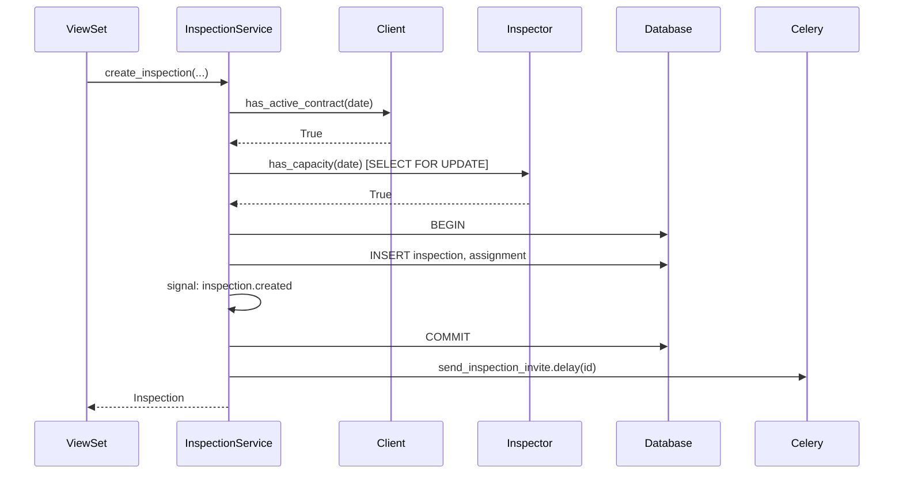

# Pass 4 — Per-cluster deep dive

The expensive pass. Per-module, write the artifact pages decided in the plan.

This file is **also the subagent prompt** when running on Claude Code with parallelism. The orchestrator dispatches one subagent per module-artifact pair (or per module, depending on size), passing this prompt + module-specific data + the stack convention.

## Inputs you'll receive (per cluster)

When invoked as a subagent OR when running this pass yourself, you'll have:

- `module` — the module entry from `.inventory.json` (name, path, god_nodes, artifacts_present, etc.)
- `stack` — the repo's stack
- `domain_context` — from `docs-config.json`
- `plan_for_module` — the section from `.plan.md` listing which files to produce
- `repo_root` — absolute path
- `group_repos` — list of other repos in the group with their paths (for cross-repo links)
- `merged_graph_path` — `~/.graphify/groups/<group>.json` (for cross-repo queries)

## Files you must produce

Read `conventions/<stack>.md` to know the canonical artifact set. The plan tells you which artifacts get dedicated files vs are folded into README.

Always produce `<repo>/docs/modules/<module>/README.md`. Then per the plan, zero or more of:
- `api.md`, `models.md`, `services.md`, `repositories.md`, `serializers.md`, `permissions.md`, `tasks.md`, `signals.md`, `admin.md`, `flows.md`
- (frontend) `pages.md`, `components.md`, `hooks.md`, `stores.md`, `services.md`, `types.md`
- (mobile) `screens.md`, `components.md`, `hooks.md`, `stores.md`, `services.md`, `native.md`, `platform-notes.md`
- (go) `handlers.md`, `domain.md`, `storage.md`, `transport.md`, `dependencies.md`, `deployment.md`

## What "deep dive" means concretely

Documentation must be **detailed enough to explain how a report is generated, what a complex query does, etc.** That means:

- For each significant function/method/handler: 1-3 paragraphs minimum.
  - What it does (purpose stated in domain terms)
  - Inputs and outputs (types, validation, defaults)
  - Side effects (DB writes, queue publishes, network calls, file I/O)
  - Why it's shaped this way, IF inferable from comments, naming, or context (otherwise omit — don't make stuff up)
  - Code reference: `path/to/file.py:LINE`

- For complex queries (joins, aggregates, raw SQL, ORM with prefetch_related): walkthrough.
  - State the query in English first ("Returns inspections in the last 30 days for clients who...")
  - Then show the key code, annotated.
  - Explain non-obvious choices (why prefetch, why exists() vs count(), why select_for_update).

- For algorithms (loops, recursion, business rule chains): step-by-step.
  - "First, X. If condition, then Y. Otherwise..."
  - Mermaid flowchart for >3 branches.

- For services orchestrating multiple components: mermaid sequence diagram.
  - Actor → Service → Model → External (e.g., User → InspectionService → Inspection model → S3 → Notification queue)

- For state machines (status fields with multiple values): mermaid stateDiagram.

- For complex types/models with nested relationships: ER-style mermaid diagram.

## Concrete file templates

### `modules/<name>/README.md`

```markdown
<!-- docs:auto -->
# <Module display name>

<!-- auto:start id=summary -->
*One sentence in domain terms — what business capability does this module own?*

E.g., "Owns the inspection lifecycle from creation through publication of results."
<!-- auto:end -->

<!-- auto:start id=responsibilities -->
## Responsibilities

What this module owns:
- ...
- ...

What this module does NOT own (with pointers):
- Authentication → see `cross-cutting/permissions.md`
- Billing of inspection fees → see `modules/billing/`
<!-- auto:end -->

<!-- auto:start id=key-types -->
## Key types

The 3-5 most important domain entities exposed by this module. One paragraph each.

### `Inspection`
The central entity. An Inspection has a status (`scheduled` → `in_progress` →
`complete` | `cancelled`), is owned by a Client and assigned to an Inspector,
and produces a Result on completion.
See [models.md](models.md) for fields and relationships.

### `Inspector`
...
<!-- auto:end -->

<!-- auto:start id=public-surface -->
## Public surface

What other modules consume from here:

- HTTP API (12 endpoints) → [api.md](api.md)
- Service classes (8 methods) → [services.md](services.md)
- Models (5) → [models.md](models.md)
- Permission classes (3) → [permissions.md](permissions.md)
- Celery tasks (2 — folded below)

### Tasks (2)

Two background tasks live in this module (folded here because there are <5):

- `send_inspection_reminder(inspection_id)` — fires 24h before scheduled time. ...
- `cleanup_orphan_attachments()` — daily; removes uploaded photos for cancelled inspections.
<!-- auto:end -->

<!-- auto:start id=consumers -->
## Consumers (other modules that use this one)

Inferred from imports:
- `billing` — calls `InspectionService.get_completed_for_client()`
- `notifications` — listens for inspection.completed signal
- `users` — references InspectionAssignment in user dashboard
<!-- auto:end -->

<!-- auto:start id=upstream -->
## Upstream (modules this one depends on)

- `auth` — for permission checks
- `users` — for inspector + client lookups
- `clients` — for property and contract data
<!-- auto:end -->

<!-- auto:start id=read-next -->
## Read next

- API surface: [api.md](api.md)
- Data model: [models.md](models.md)
- Business logic: [services.md](services.md)
- Permission rules: [permissions.md](permissions.md)
- Ops behavior: [tasks.md](tasks.md)
<!-- auto:end -->
```

### `modules/<name>/api.md` (when present)

```markdown
<!-- docs:auto -->
# <Module> — API

<!-- auto:start id=summary -->
N endpoints. Mounted at `<base path>`.
Authentication: <inferred from urls/views/decorators>.
<!-- auto:end -->

<!-- auto:start id=endpoints -->
## Endpoints

### POST `/api/v1/inspections/`

Create a new inspection.

**Auth**: `IsAuthenticated` + `IsClientOwnerOrInspector`
**Permission**: `inspections.add_inspection`

**Request body**:
```json
{
  "client_id": 12,
  "scheduled_at": "2026-06-15T10:00:00Z",
  "property_id": 34,
  "inspector_id": 7
}
```

**Validation**:
- `scheduled_at` must be in the future and within client's active contract window
- `inspector_id` must have capacity for that day (see [services.md](services.md#assign-inspector))
- 🟡 *behavior on race condition with capacity unclear from code — verify*

**Response 201**:
```json
{ "id": 401, "status": "scheduled", ... }
```

**Side effects**:
- Inspection created in DB (`status='scheduled'`)
- `inspection.created` signal fired (notifications module subscribes)
- Calendar invite queued (celery task `send_inspection_invite`)

**Handler**: [`InspectionViewSet.create`](../../../core/inspections/api.py#L42)
**Service**: [`InspectionService.create_inspection`](services.md#create-inspection)

**Cross-repo callers**:
- Mobile: [`createInspection` service](../../../../../core-mobile/docs/modules/inspections/services.md#createinspection)
- Frontend: [`useCreateInspection` hook](../../../../../upvate_core_frontend/docs/modules/inspections/hooks.md#usecreateinspection)

---

### GET `/api/v1/inspections/{id}/`

...

<!-- auto:end -->
```

### `modules/<name>/services.md` (when present)

```markdown
<!-- docs:auto -->
# <Module> — Services

<!-- auto:start id=summary -->
Service-layer methods that encapsulate business logic. Called by the API
layer and by other modules.
<!-- auto:end -->

<!-- auto:start id=services -->
## `InspectionService`

[`core/inspections/services.py:1`](../../../core/inspections/services.py)

Coordinates inspection lifecycle operations. Stateless; consumes models and
external integrations.

### `create_inspection(client_id, scheduled_at, ..., *, by_user) -> Inspection`

[`core/inspections/services.py:23`](../../../core/inspections/services.py#L23)

Creates a new inspection record after validating capacity and contract window.

**Why a service method, not just `Inspection.objects.create()`**: needs to
coordinate inspector capacity check + contract validation + signal fire +
calendar invite — these belong together, not in views.

**Steps**:
1. Validate `client.has_active_contract(scheduled_at)`. Raises `ContractError`
   if not. (Why this check is here and not in serializer: ...)
2. Validate `inspector.has_capacity(scheduled_at.date())`. The capacity check
   walks all assignments for that day and checks against `Inspector.daily_capacity`.
   See [`Inspector.has_capacity`](models.md#inspector).
3. Inside a transaction:
   - Create the `Inspection` row with `status='scheduled'`
   - Create the `InspectionAssignment` row linking inspector
   - Fire `inspection.created` signal
4. Outside the transaction (so signal handlers don't block):
   - Queue celery task `send_inspection_invite` with the new ID

**Returns**: the new `Inspection` (refreshed from DB after signal handlers).

**Edge cases handled**:
- Concurrent capacity check via `select_for_update` on `Inspector` row.
- Contract expiring exactly at `scheduled_at` is treated as valid.
- 🟡 *unclear whether timezone of `scheduled_at` is normalized — verify*.



---

### `assign_inspector(inspection_id, inspector_id)` ...

...
<!-- auto:end -->
```

### Other artifact files

Apply the same pattern: 1-3 paragraphs per significant item, code refs, mermaid where useful, `🟡` for guesses, cross-repo links via the merged graph.

## Cross-repo link resolution

For each external API/service call you find:

1. Check the merged group graph (`~/.graphify/groups/<group>.json`) for a node matching the URL/method.
2. If found, get the `repo` field on that node and the `source_file`.
3. Compute relative path from current doc to `<that-repo-root>/docs/modules/<that-module>/api.md`.
4. Include an anchor `#<verb>-<path-as-slug>` (will be verified in pass 8).

If not found in graph: write the bare path/URL as text and add to `.cross-link-todo.md`.

## Persist discoveries via `graphify save-result`

After tracing any of the following during this pass, run `graphify save-result` (Bash tool) so the finding becomes graph-queryable for all future sessions:

- **Cross-repo HTTP boundary** (mobile/frontend → backend): `--type path_query`, include both the caller node label and the handler node label in `--nodes`.
- **Emergent behavior** (status change driven by multiple files, no single anchor): `--type query`.
- **Complex query walkthrough** (you explained a multi-join ORM query or raw SQL): `--type query`.
- **Architectural pattern in this module** (registry, strategy, observer, command bus): `--type explain`.

Format the `--question` as something an engineer might actually ask the graph later (not just a heading). The `--answer` should be a 2-5 sentence dense factual summary — *not* the full doc page; the doc page lives at the file path, the saved result is for queries that may not even know the doc exists.

Example after documenting `InspectionService.create_inspection`:

```bash
graphify save-result \
  --question "How is inspector capacity enforced when scheduling an inspection?" \
  --answer   "InspectionService.create_inspection acquires SELECT FOR UPDATE on the inspector row, calls Inspector.has_capacity(date) which counts existing assignments against Inspector.daily_capacity, then commits. Race-safe across concurrent requests on the same inspector. Concurrent requests on different inspectors do not block each other." \
  --type     query \
  --nodes    "InspectionService.create_inspection" "Inspector.has_capacity" "InspectionAssignment"
```

Skip `save-result` for trivial structural facts (which class is in which file). Use it specifically for findings the static graph cannot encode.

Track count of save-results in this pass; report in run summary.

## Idempotence

Before writing each file:
1. If file exists with `<!-- docs:manual -->`: skip entirely.
2. If file exists with `<!-- docs:auto -->`: extract human:* blocks, regenerate auto:* blocks with new content, splice human blocks back in.
3. If new file: write fresh.

After writing, update `docs/.metadata.json` with the file's source SHAs.

## Skip rules (re-runs)

Before processing a module:
1. Compute current fingerprint = SHA of (god_node_ids + their file SHAs).
2. Compare to last fingerprint in `.metadata.json` for this module.
3. If unchanged: skip module entirely. Print `<module>: unchanged, skipped`.
4. If `--force` flag: ignore fingerprint, regenerate.

## Token discipline

You can read whole files for god nodes that are dense and small (<200 lines).
For large files, use Read with offset/limit to read only the methods you're documenting.
Never read the whole graph.json — query it via specific node lookups.

## After all modules complete

Print a one-line summary per module:
```
inspections: 6 files written (api, models, services, permissions, tasks-folded, README) — 3 🟡
auth:        3 files written (api, services, README)
billing:     unchanged, skipped
```

Then proceed to `prompts/05-reference.md`.
