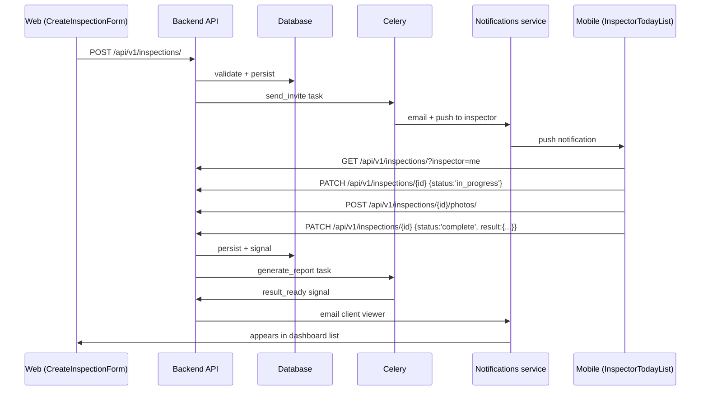
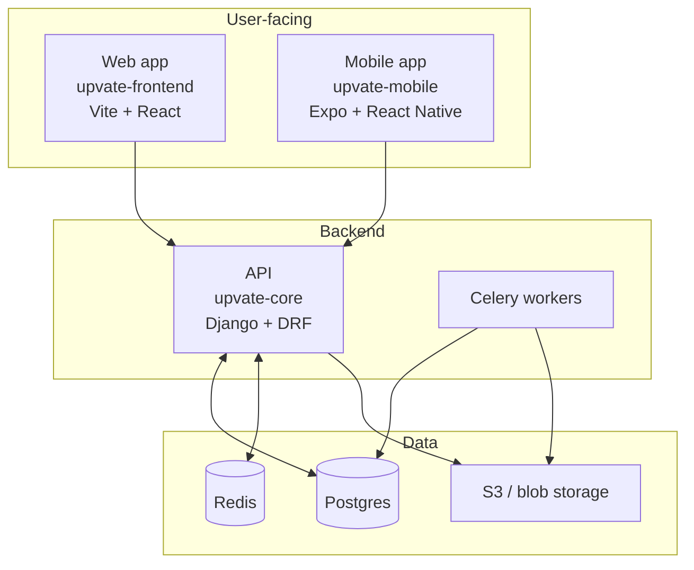

# Pass 7 — Group synthesis (cross-repo)

Run only in `--group` mode, and only after per-repo docs exist for all repos in the group.

## Your goal

Write the **business-oriented, narrative** documentation at the group level. Same care as per-repo, but the scope is the product, not any single codebase.

Reads from:
- The merged graph at `~/.graphify/groups/<group>.json`
- Each repo's `docs/.inventory.json` (to know what's documented per repo)
- `docs-config.json` (domain context)
- Each repo's per-module READMEs (for cross-repo linking)

Writes to: `<group_docs_path>` (from `docs-config.json`).

## Files to produce

```
<group_docs_path>/
├── README.md                          # product 1-pager + doc map
├── product/
│   ├── overview.md                    # what the product does, narrative
│   ├── personas.md                    # primary users, use cases
│   ├── glossary.md                    # unified domain vocabulary
│   └── user-journeys/
│       ├── README.md
│       ├── <journey-1>.md             # one per discovered user journey
│       └── ...
├── architecture/
│   ├── system-overview.md             # high-level diagram, repo roles
│   ├── shared-data-model.md           # entities crossing repos
│   ├── deployment-topology.md         # if discoverable from CI configs
│   └── flows/
│       ├── auth.md                    # cross-repo auth flow
│       ├── <flow-name>.md             # one per major cross-repo flow
│       └── ...
├── reference/
│   ├── api-contracts.md               # endpoints + which clients call each
│   ├── shared-libs.md                 # internal packages used across repos
│   └── third-party-integrations.md
├── services/                          # only if any repo is microservices style
│   └── <service-name>/...
└── decisions/
    ├── README.md                      # ADR pattern explanation
    ├── template.md                    # blank ADR template
    └── _suggestions.md                # 🟡 unusual patterns worth ADR'ing
```

## How to discover user journeys

A user journey crosses repos. Detection heuristic:

1. From the merged graph, find clusters of nodes that span ≥2 repos and are linked via API call edges.
2. For each such cluster, the entry point is usually a frontend page or mobile screen (`Login`, `CreateInspection`, `Dashboard`).
3. Trace the flow: page → hook → API endpoint → backend handler → service → DB → response → state update → UI render.

Write each as a sequence diagram in mermaid plus prose.

```markdown
<!-- docs:auto -->
# Inspection lifecycle

<!-- auto:start id=summary -->
*From scheduling on the web dashboard to viewing the result on mobile.
This is the core user journey.*
<!-- auto:end -->

<!-- auto:start id=actors -->
## Actors

- **Client admin** (web) — schedules inspections
- **Inspector** (mobile) — performs inspections, uploads results
- **Client viewer** (web) — reviews completed inspections
<!-- auto:end -->

<!-- auto:start id=flow -->
## End-to-end flow


<!-- auto:end -->

<!-- auto:start id=touchpoints -->
## Touchpoints (per repo)

### Frontend (upvate-frontend)
- Page: [`CreateInspectionForm`](../../upvate_core_frontend/docs/modules/inspections/pages.md#createinspectionform)
- Service: [`createInspection`](../../upvate_core_frontend/docs/modules/inspections/services.md#createinspection)

### Backend (upvate-core)
- Endpoint: [`POST /api/v1/inspections/`](../../upvate_core/docs/modules/inspections/api.md#post-apiv1inspections)
- Service: [`InspectionService.create_inspection`](../../upvate_core/docs/modules/inspections/services.md#create_inspection)

### Mobile (upvate-mobile)
- Screen: [`InspectorTodayList`](../../core-mobile/docs/modules/inspections/screens.md#inspectortodaylist)
- Service: [`fetchAssignedInspections`](../../core-mobile/docs/modules/inspections/services.md#fetchassignedinspections)
<!-- auto:end -->

<!-- auto:start id=domain-rules -->
## Domain rules surfaced by this flow

- An inspection cannot be created outside the client's contract window.
- An inspector cannot exceed `daily_capacity` (default: 4) per day.
- Photos must be uploaded before status can move to `complete`.
- A `complete` inspection auto-generates a Result, which triggers the report task.
<!-- auto:end -->

<!-- auto:start id=failure-modes -->
## Failure modes & recoveries

- **Network failure mid-upload (mobile)**: photos retry with exponential backoff; status stays `in_progress` until success.
- **Inspector capacity race**: `select_for_update` on the inspector row prevents double-booking; retry once on conflict.
- 🟡 *what happens if `generate_report` task fails?* — investigate retry policy.
<!-- auto:end -->
```

## `system-overview.md`

```markdown
<!-- docs:auto -->
# System overview — <group>

<!-- auto:start id=elevator -->
*One paragraph: what the system as a whole does.*
<!-- auto:end -->

<!-- auto:start id=components -->
## Components



Each component:
- **upvate-frontend** — web app for client admins. Talks to backend over HTTPS. State: zustand.
- **upvate-mobile** — Expo app for inspectors. Same backend. Offline-first via TanStack Query persistence.
- **upvate-core** — Django REST Framework + Postgres. Background work via Celery.
<!-- auto:end -->

<!-- auto:start id=tech-choices -->
## Stack at a glance

| Concern | Tech |
|---------|------|
| Web framework (backend) | Django 4.2 |
| API style | REST (DRF) |
| Web frontend | Vite + React 18 + Zustand |
| Mobile | Expo + React Native + TanStack Query |
| Database | Postgres 14 |
| Background jobs | Celery + Redis |
| Auth | DRF token auth |
| Object storage | S3 |
| CI/CD | Bitbucket Pipelines |
<!-- auto:end -->
```

## `glossary.md`

Combine domain vocabulary from `docs-config.json` with terms inferred from cross-repo god-node names. Each entry:
- Term
- Definition (1-2 sentences)
- Where it lives (which models/types/screens use it)
- Aliases / synonyms (so people don't reuse different words for the same thing)

## `api-contracts.md`

Single page listing every backend endpoint + which clients call it.

```markdown
<!-- docs:auto -->
# API contracts

All endpoints exposed by `upvate-core`. Auth: Token unless noted.

| Method | Path | Handler | Frontend caller | Mobile caller | Notes |
|--------|------|---------|-----------------|---------------|-------|
| POST | /api/v1/auth/login/ | [`LoginView`](../../upvate_core/docs/modules/auth/api.md#login) | [`useLogin`](../../upvate_core_frontend/docs/modules/auth/hooks.md#uselogin) | [`login`](../../core-mobile/docs/modules/auth/services.md#login) | unauth |
| GET | /api/v1/inspections/ | ... | ... | ... | |
| ...
```

Useful for discovering orphaned endpoints (no caller) and understanding the surface.

## `decisions/README.md` (ADR pattern)

```markdown
<!-- docs:manual -->
# Architecture Decision Records

This folder holds short markdown files capturing **architectural
decisions**. Each file = one decision.

## When to write one

Write an ADR when you decide:
- A non-obvious technical direction (framework choice, layering, data model)
- A consequence-bearing tradeoff (consistency vs availability, monolith vs split)
- A reversal of a previous decision

Don't write one for routine implementation choices.

## Format

Use [`template.md`](template.md). Number sequentially: `0001-foo.md`.

## Index

(Empty — write your first one.)

## Suggested ADRs

The docs generator may flag patterns it noticed that look like
undocumented decisions. See [`_suggestions.md`](_suggestions.md).
```

`template.md` (manual; never overwrite):

```markdown
# ADR-NNNN: <decision title>

- Status: proposed | accepted | superseded by ADR-XXXX
- Date: YYYY-MM-DD
- Deciders: <names>

## Context
<the problem, the constraints, what's currently true>

## Decision
<the decision in 1-3 sentences>

## Alternatives considered
- ...

## Consequences
- positive: ...
- negative: ...
- neutral: ...
```

`_suggestions.md` is auto:
```markdown
<!-- docs:auto -->
# Suggested ADR topics

Patterns the docs generator noticed that may warrant an explicit decision record.

<!-- auto:start id=suggestions -->
- 🟡 Two HTTP clients in the frontend (axios in `services/legacy/`, fetch in `services/v2/`) — looks like an in-progress migration, no ADR found.
- 🟡 State management: zustand (most modules) + Redux Toolkit (auth only) — was this intentional?
- ...
<!-- auto:end -->

*The skill never writes ADRs themselves — those are human decisions.*
```

## Persist cross-repo flows via `graphify save-result`

This is the highest-value place to call `save-result` — every user journey you trace is exactly the kind of finding that the static graph cannot encode (HTTP boundaries, emergent multi-repo behaviors).

For each user journey + each cross-repo flow you write:

```bash
graphify save-result \
  --question "<question phrased as if asked of the graph>" \
  --answer   "<3-6 sentence dense summary of the flow, naming the canonical nodes>" \
  --type     path_query \
  --nodes    "<entry-point-node>" "<intermediate-1>" "<intermediate-2>" "<terminal-node>"
```

Include nodes from EVERY repo the flow crosses — that's how the graph picks up cross-repo edges that AST extraction can't see.

Aim for ~1 save-result per user journey + ~1 per technical flow. Don't over-save — each one should be a unique cross-repo finding, not duplicated structural facts.

Track count for the run summary.

## Idempotence + metadata

Same rules. The group-level `.metadata.json` lives at `<group_docs_path>/.metadata.json`.

## After completion

Print summary. Proceed to `prompts/08-cross-link.md`.
