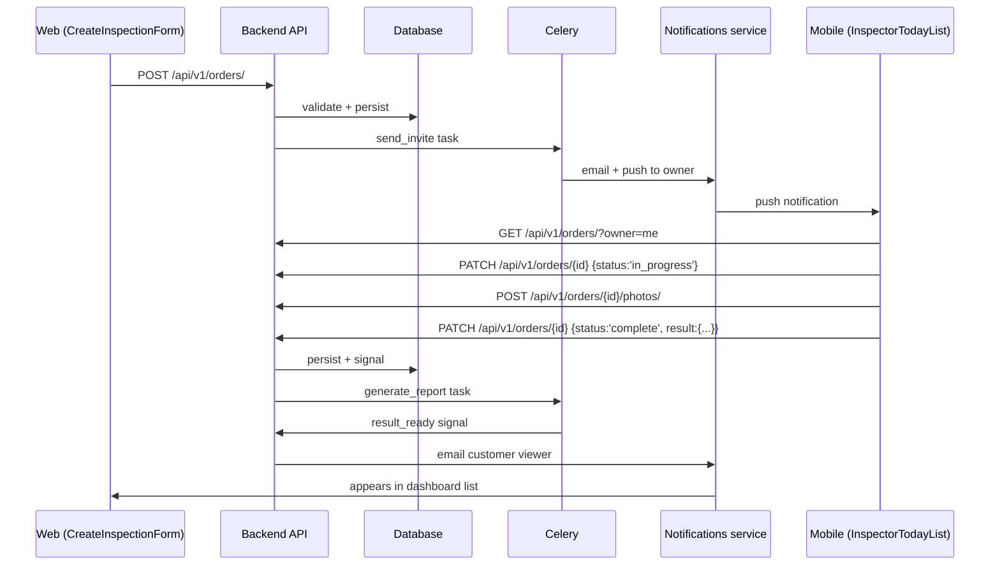
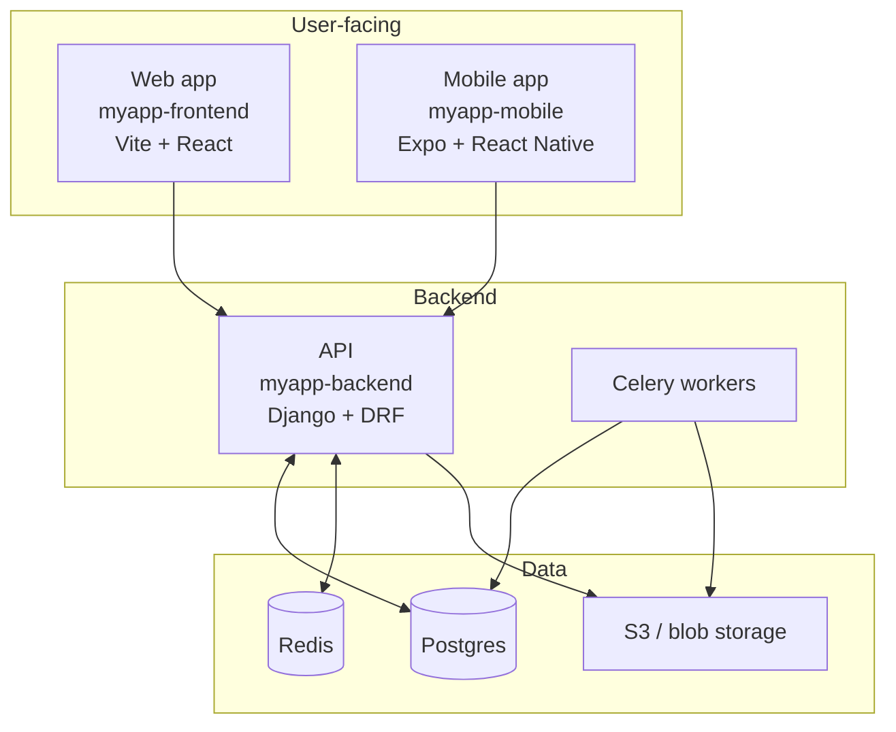

# Pass 7 — Group synthesis (cross-repo)

Run only in `--group` mode, and only after per-repo docs exist for all repos in the group.

**Apply `conventions/_graph-searchability.md`**: every endpoint, screen name, service function, hook, repo name, and shared model in backticks every time — this is what makes a journey heading link to the code in every repo it touches. Every fenced code block language-tagged.

## Your goal

Write the **business-oriented, narrative** documentation at the group level. Same care as per-repo, but the scope is the product, not any single codebase.

## Orchestration model

On **Claude Code**, the orchestrator coordinates only — every page in this pass is delegated to a subagent (see `SKILL.md`'s coordinator-only rule). Each subagent must read, before writing:

- This prompt (`prompts/07-group-synthesis.md`).
- For user-journey pages: the canonical template at `~/.claude/skills/generate-docs/output-templates/user-journey.md` (authoritative for journey doc structure).
- The relevant slice of the merged graph + per-repo `docs/.inventory.json` files + `docs-config.json`.

For non-journey pages in this pass (`system-overview.md`, `glossary.md`, `api-contracts.md` / `api-orders.md`, ADR scaffolding, etc.) the inline templates in this prompt are the source of truth — they're one-off page shapes, not covered by the shared output-templates.

On **Windsurf**, the agent writes directly with no delegation.

In both harnesses: "How it works" / "End-to-end flow" prose MUST be plain prose (and/or mermaid diagrams). Do NOT generate annotated code blocks that walk through logic with `# comments` — link to the source instead.

Reads from:
- The merged graph at `~/.graphify/groups/<group>.json`
- Each repo's `docs/.inventory.json` (to know what's documented per repo)
- `docs-config.json` (domain context)
- Each repo's per-module READMEs (for cross-repo linking)

Writes to: `<group_docs_path>` (from `docs-config.json`).

## Files to produce

```
<group_docs_path>/
├── index.md                           # product 1-pager + doc map (VitePress homepage; NOT README.md)
├── product/
│   ├── overview.md                    # what the product does, narrative
│   ├── personas.md                    # primary users, use cases
│   ├── glossary.md                    # unified domain vocabulary
│   └── user-journeys/
│       ├── index.md                   # journey index (VitePress homepage convention)
│       ├── <journey-1>.md             # one per discovered user journey — uses output-templates/user-journey.md
│       └── ...
├── architecture/
│   ├── system-overview.md             # high-level diagram, repo roles
│   ├── shared-data-model.md           # entities crossing repos
│   ├── deployment-topology.md         # if discoverable from CI configs
│   └── flows/
│       ├── auth.md                    # cross-repo auth flow
│       ├── <flow-name>.md             # one per major cross-repo flow
│       └── ...
├── reference/
│   ├── api-orders.md               # endpoints + which clients call each
│   ├── shared-libs.md                 # internal packages used across repos
│   └── third-party-integrations.md
├── services/                          # only if any repo is microservices style
│   └── <service-name>/...
└── decisions/
    ├── index.md                       # ADR pattern explanation (VitePress homepage)
    ├── template.md                    # blank ADR template
    └── _suggestions.md                # 🟡 unusual patterns worth ADR'ing
```

> Note: VitePress is the default static site (Pass 9). Across all generated trees, the homepage convention is `index.md` — never `README.md`. If a legacy `README.md` exists at any of these paths from an older run, replace with `index.md` on regeneration.

## How to discover user journeys

A user journey crosses repos. Detection heuristic:

1. From the merged graph, find clusters of nodes that span ≥2 repos and are linked via API call edges.
2. For each such cluster, the entry point is usually a frontend page or mobile screen (`Login`, `CreateInspection`, `Dashboard`).
3. Trace the flow: page → hook → API endpoint → backend handler → service → DB → response → state update → UI render.

## User-journey page format

Every `<group_docs_path>/product/user-journeys/<journey>.md` MUST follow the canonical template:

**`~/.claude/skills/generate-docs/output-templates/user-journey.md`**

That template defines the section order, anchor IDs, the actors / flow / touchpoints / domain-rules / failure-modes structure, and the mermaid sequence-diagram conventions. The example below in this prompt is illustrative — for any structural question, the canonical template is authoritative.

Subagents writing journey pages on Claude Code must load the template first.

The example block that follows (a populated "Order lifecycle" journey) is provided for orientation only.

```markdown
<!-- docs:auto -->
# Order lifecycle

<!-- auto:start id=summary -->
*From scheduling on the web dashboard to viewing the result on mobile.
This is the core user journey.*
<!-- auto:end -->

<!-- auto:start id=actors -->
## Actors

- **Customer admin** (web) — schedules orders
- **Owner** (mobile) — performs orders, uploads results
- **Customer viewer** (web) — reviews completed orders
<!-- auto:end -->

<!-- auto:start id=flow -->
## End-to-end flow


<!-- auto:end -->

<!-- auto:start id=touchpoints -->
## Touchpoints (per repo)

### Frontend (myapp-frontend)
- Page: [`CreateInspectionForm`](../../myapp-frontend/docs/modules/orders/pages.md#createinspectionform)
- Service: [`createInspection`](../../myapp-frontend/docs/modules/orders/services.md#createinspection)

### Backend (myapp-backend)
- Endpoint: [`POST /api/v1/orders/`](../../myapp-backend/docs/modules/orders/api.md#post-apiv1inspections)
- Service: [`OrderService.create_order`](../../myapp-backend/docs/modules/orders/services.md#create_order)

### Mobile (myapp-mobile)
- Screen: [`InspectorTodayList`](../../myapp-mobile/docs/modules/orders/screens.md#inspectortodaylist)
- Service: [`fetchAssignedInspections`](../../myapp-mobile/docs/modules/orders/services.md#fetchassignedinspections)
<!-- auto:end -->

<!-- auto:start id=domain-rules -->
## Domain rules surfaced by this flow

- An order cannot be created outside the customer's order window.
- An owner cannot exceed `daily_capacity` (default: 4) per day.
- Photos must be uploaded before status can move to `complete`.
- A `complete` order auto-generates a Result, which triggers the report task.
<!-- auto:end -->

<!-- auto:start id=failure-modes -->
## Failure modes & recoveries

- **Network failure mid-upload (mobile)**: photos retry with exponential backoff; status stays `in_progress` until success.
- **Owner capacity race**: `select_for_update` on the owner row prevents double-booking; retry once on conflict.
- 🟡 *what happens if `generate_report` task fails?* — investigate retry policy.
<!-- auto:end -->
```

## `system-overview.md`

```markdown
<!-- docs:auto -->
# System overview — <group>

<!-- auto:start id=elevator -->
*One paragraph: what the system as a whole does.*
<!-- auto:end -->

<!-- auto:start id=components -->
## Components



Each component:
- **myapp-frontend** — web app for customer admins. Talks to backend over HTTPS. State: zustand.
- **myapp-mobile** — Expo app for inspectors. Same backend. Offline-first via TanStack Query persistence.
- **myapp-backend** — Django REST Framework + Postgres. Background work via Celery.
<!-- auto:end -->

<!-- auto:start id=tech-choices -->
## Stack at a glance

| Concern | Tech |
|---------|------|
| Web framework (backend) | Django 4.2 |
| API style | REST (DRF) |
| Web frontend | Vite + React 18 + Zustand |
| Mobile | Expo + React Native + TanStack Query |
| Database | Postgres 14 |
| Background jobs | Celery + Redis |
| Auth | DRF token auth |
| Object storage | S3 |
| CI/CD | Bitbucket Pipelines |
<!-- auto:end -->
```

## `glossary.md`

Combine domain vocabulary from `docs-config.json` with terms inferred from cross-repo god-node names. Each entry:
- Term
- Definition (1-2 sentences)
- Where it lives (which models/types/screens use it)
- Aliases / synonyms (so people don't reuse different words for the same thing)

## `api-orders.md`

Single page listing every backend endpoint + which clients call it.

```markdown
<!-- docs:auto -->
# API orders

All endpoints exposed by `myapp-backend`. Auth: Token unless noted.

| Method | Path | Handler | Frontend caller | Mobile caller | Notes |
|--------|------|---------|-----------------|---------------|-------|
| POST | /api/v1/auth/login/ | [`LoginView`](../../myapp-backend/docs/modules/auth/api.md#login) | [`useLogin`](../../myapp-frontend/docs/modules/auth/hooks.md#uselogin) | [`login`](../../myapp-mobile/docs/modules/auth/services.md#login) | unauth |
| GET | /api/v1/orders/ | ... | ... | ... | |
| ...
```

Useful for discovering orphaned endpoints (no caller) and understanding the surface.

## `decisions/index.md` (ADR pattern)

```markdown
<!-- docs:manual -->
# Architecture Decision Records

This folder holds short markdown files capturing **architectural
decisions**. Each file = one decision.

## When to write one

Write an ADR when you decide:
- A non-obvious technical direction (framework choice, layering, data model)
- A consequence-bearing tradeoff (consistency vs availability, monolith vs split)
- A reversal of a previous decision

Don't write one for routine implementation choices.

## Format

Use [`template.md`](template.md). Number sequentially: `0001-foo.md`.

## Index

(Empty — write your first one.)

## Suggested ADRs

The docs generator may flag patterns it noticed that look like
undocumented decisions. See [`_suggestions.md`](_suggestions.md).
```

`template.md` (manual; never overwrite):

```markdown
# ADR-NNNN: <decision title>

- Status: proposed | accepted | superseded by ADR-XXXX
- Date: YYYY-MM-DD
- Deciders: <names>

## Context
<the problem, the constraints, what's currently true>

## Decision
<the decision in 1-3 sentences>

## Alternatives considered
- ...

## Consequences
- positive: ...
- negative: ...
- neutral: ...
```

`_suggestions.md` is auto:
```markdown
<!-- docs:auto -->
# Suggested ADR topics

Patterns the docs generator noticed that may warrant an explicit decision record.

<!-- auto:start id=suggestions -->
- 🟡 Two HTTP clients in the frontend (axios in `services/legacy/`, fetch in `services/v2/`) — looks like an in-progress migration, no ADR found.
- 🟡 State management: zustand (most modules) + Redux Toolkit (auth only) — was this intentional?
- ...
<!-- auto:end -->

*The skill never writes ADRs themselves — those are human decisions.*
```

## Persist cross-repo flows via `graphify save-result`

This is the highest-value place to call `save-result` — every user journey you trace is exactly the kind of finding that the static graph cannot encode (HTTP boundaries, emergent multi-repo behaviors).

For each user journey + each cross-repo flow you write — **dual-save** to both per-repo memory (closest repo, e.g. backend) AND the group memory dir:

```bash
# Group memory (mandatory — this is where MCP queries via graphify-<group> read)
graphify save-result \
  --memory-dir ~/.graphify/groups/<group>-memory/ \
  --question "<question phrased as if asked of the graph>" \
  --answer   "<3-6 sentence dense summary of the flow, naming the canonical nodes>" \
  --type     path_query \
  --nodes    "<entry-point-node>" "<intermediate-1>" "<intermediate-2>" "<terminal-node>"

# Also save into the primary backend repo's memory/ — useful if anyone ever spins up a per-repo MCP
graphify save-result \
  --memory-dir <backend-repo>/graphify-out/memory/ \
  --question "<same>" \
  --answer   "<same>" \
  --type     path_query \
  --nodes    "<same>"
```

Include nodes from EVERY repo the flow crosses — that's how the graph picks up cross-repo edges that AST extraction can't see.

Aim for ~1 save-result per user journey + ~1 per technical flow. Don't over-save — each one should be a unique cross-repo finding, not duplicated structural facts.

Track count for the run summary.

## Idempotence + metadata

Apply the same idempotence rules as the per-repo passes: preserve `<!-- docs:manual -->` blocks and human-edited regions verbatim, regenerate only `auto:start`/`auto:end` islands, replace any legacy `README.md` homepage with `index.md`, and update `<group_docs_path>/.metadata.json` with new file hashes + the merged-graph version used.

## After completion

Print summary. Proceed to `prompts/08-cross-link.md`.
